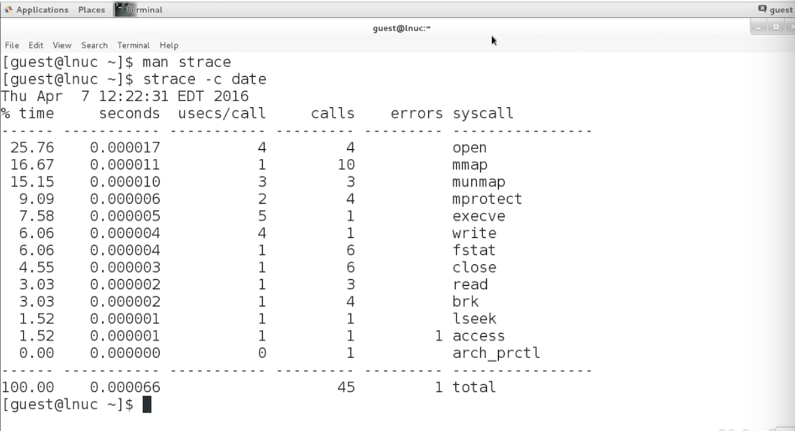

# Linux Kernel Fundamentals

*Information taken from [Linux kernel Fundamentals](https://www.linkedin.com/learning/linux-kernel-fundamentals/) course.*

## Contents
* [Charpter 1. Surveying the Linux Kernel](#1-surveying-the-linux-kernel)
* [Charpter 2. Booting](#2-booting)
* [Charpter 3. Loadable Kernel Modules](#3-working-with-loadable-kernel-modules)


## 1. Surveying the Linux Kernel

### What Is The Linux Kernel?
- It is the core program:` vmlinuz`
- We need a boot loader, normally `GRUB` to load the image into memory.
- **The kernel is an API.** It provides:
    - System calls
    - Virtual fs entries to interact directly with the kernel: `proc, sys, debugs`
    - Device files. We do read/write operations using system calls
- **Gatekeeper**:
     - Enforces privileges depending on each process.
     - Control access to hardware and other resources.
- **Modular**
     - The `vmlinuz` is small. Once it is loaded into user space, it adds more functionality.
	- It loads only the drivers we are interested on
 
### Discovering And Controlling Hardware
- Applications call functions in libraries. Some of those functions invoke kernel system calls.
- `lspci`- Show PCI devices information:
	- **Example:**
		- Find if the network card is connected and which driver is using.
- Control HW configuration directly from the kernel by writing in `proc, dev, sys`
 
### System Calls
- System calls are functions implemented by the kernel and meant to ve called from user space (exists about 300 different system calls)
	- See 	`units.h`
- Applications call library functions. Those functions in c, invoke the system call. **architecture-dependent** 

#### System Call Return
-  If an error occurs it returns a negative value to the library
- The library set the global variable of the process `errno` to `abs(return value)` and returns -1.
- If no error, then it returns 0 or a positive  number.
#### Keep track of System Calls
- Use `strace` command to trace system calls and signals in a process.
	- `strace` prints in `stderr`. In order to pass it into a pipe we should do this trick:
		`strace fdisk -l |& grep /sys/block` 
- **Example:**
	- 

### Read Messages From The Kernel
- `printk()` : Just to print messages.
	- It puts the message into a buffer in RAM.
	- It may go to console or into a log file.
- `dmesg` Shows RAM buffer messages from kernel.
 
### Virtual FS: Use the /proc And /sys Filesystems
- The `proc` and `sysfs` filesystems are virtual filesystems.
- Their contents are not stored on disk.
	- When you `cat`a file in there, the content is generated on demand. It is a function from the kernel that is being called.

#### /proc - Process
-  The state of the kernel. For example `ps` gets the information  from there.
- Kernel unable variables are an important part of `/proc`
- Each process has a directory named with its PID
	- It has information on memory, program, files, etc.
	- Threads have entries under the sub-directory `task`
- `/proc/meminfo` - Show RAM information. For get available RAM we can use `free`.
- Tunnable variables are under `/proc/sys`. The same stuff from `sysctl`.

#### /sys - sysfs
- It is hardware information.
-  The directory tree reflects hardware connectivity
- **Device Files**
	- Used by *character* and *block* drivers.

## 2. Booting
### GRUB
- GRUB loads the kernel, initial root filesystem, sets up the kernel command line, and then transfer the control the kernel.
- **GRUB 1** had only one configuration file `grub.conf`
- **GRUB 2** is more sophisticated (`/etc/grub.d`)

### Kernel-command parameters
- The kernel ignores commands that are not recognized.
	- See command-line in `/proc/cmdline` or with `/dmesg`

### Process 1 & startup services
#### Initial root filesystem
- The initial RAM disk `initrd` is used to provide drivers and support for mounting the real root file system.
- The `initrd` jas an `init` program that the kernel run first.
- When the `init` from the `initrd` terminates, the Linux kernel starts `init` again; this time from the real filesystem which is commonly on disk.
- This **first process** (`init` or `systemd`) is responsable of starting up the services.
- Run levels

### initrd/initramfs File
- `initrd/initramfs` are in `/boot`. Compressed files

## 3. Working with Loadable Kernel Modules

### What is a LKM?
- File .ko (kernel object).
- Dinamically adds funcitonality to the running kernel.
- Should be written in C and compiled for a specific kernel version.
- **Advantages:**
	- Add functionality without rebooting
	- Allows for only the needed functionility to be loaded

### Where to find LKM?
- They are installed under `/lib/modules`
- In order to load modules use: `modprobe <module_name>`
		it is designed to look for the module under `/lib/modules/<uname -r>`
- `lsmod` lists the modules loaded: 
		```<module_name> <size> <in_use_flag> <used_by_modules>```
- `rmmod` removes the module
- `insmod` loads a module. You have to give the specific path of the module.
- `modinfo` shows information of specific module
- `depmod` generates de module config files for `modprobe`

### Compiling Modules
- Compile in the local directory
```make -C /lib/modules/$(uname -r)/build M=$PWD modules```
 
#### Example
- `program.c`:

	```
	#include <linux/module.h>
	#include <linux/sched.h>
	#include <linux/kernel.h>
	
	MODULE_AUTHOR("Maria Ines");
	MODULE_DESCRIPTION("Simple Module Test");
	static int number = 100;
	static char *word = "blueberries";
	module_param (number, int, S_IRUGO);
	module_param (word, charp, S_IRUGO);
	MODULE_PARAM_DESC (number, "Integer modifiable parameter");
	MODULE_PARAM_DESC (word, "String modifiable parameter");
	
	int my_init_module (void) 
	{
		printk("The module is now loaded");
		return 0;
	}
	
	module_init (my_init_module);
	
	void my_cleanup_module (void)
	{
		printk("The module is now unloaded");
	}
	
	module_exit (my_cleanup_module);
	```
- `Makefile`:

	```
	all : lab.c
		make -C /lib/modules/$(uname -r)/build M=$PWD modules
	clean :
		make -C /lib/modules/$(uname -r)/build M=$PWD clean
	obj-m : lab.o
	```
