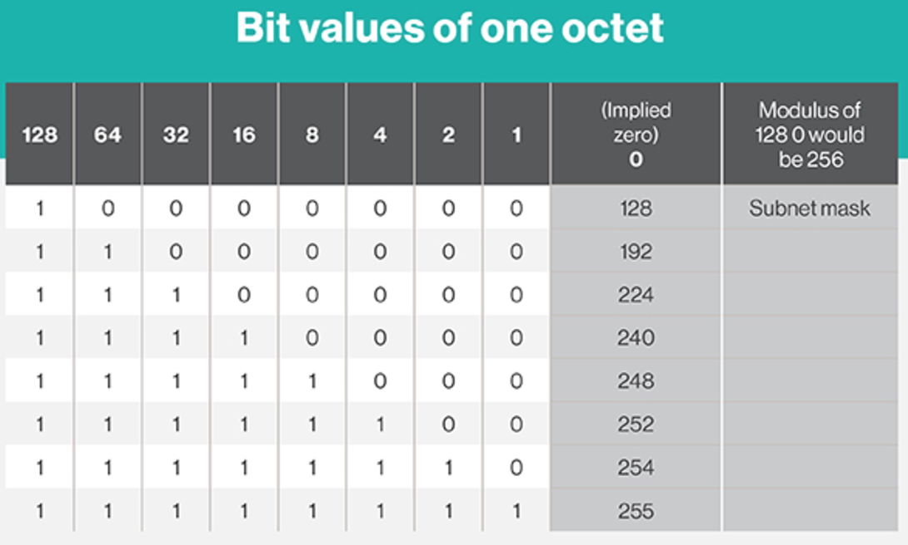

# IP subnetting


## IP address classes
- *Class A:* 1 – 126 (127 reserved for loopback and diagnostic tests)
- *Class B:* 128 – 191
- *Class C:* 192 – 223
- *Class D:* 224 – 239 (reserved, used primarily for IP multicasting)
- *Class E:* 240 – 254 (reserved, experimental)

## Private addresses
- *Class A:* 10.0.0.0 through 10.255.255.255
- *Class B:* 172.16.0.0 through 172.31.255.255
- *Class C:* 192.168.0.0 through 192.168.255.255

## How to calculate subnet masks?

You just need to remember the octets table:



### Example
Get the valid hosts in the `192.168.30.7/28` range.

- Get the mask

```
8 * 3 = 24 -> We are taking 3 octets and only four bits in the last octet.

/28 => 255.255.255.?
```

<table>
	<thead>
		<tr>
			<th>128</th>
			<th>64</th>
			<th>32</th>
			<th>16</th>
			<th>8</th>
			<th>4</th>
			<th>2</th>
			<th>1</th>
		</tr>
	</thead>
	<tbody>
		<tr>
			<td>1</td>
			<td>1</td>
			<td>1</td>
			<td>1</td>
			<td>0</td>
			<td>0</td>
			<td>0</td>
			<td>0</td>
		</tr>
	</tbody>
</table>

```
/28 => 255.255.255.240
```

- Calculate the subnet

**Network:**

*(last octet representation)*
<table>
	<thead>
		<tr>
			<th>128</th>
			<th>64</th>
			<th>32</th>
			<th>16</th>
			<th>8</th>
			<th>4</th>
			<th>2</th>
			<th>1</th>
			<th></th>
		</tr>
	</thead>
	<tbody>
		<tr>
			<td style="color:orange">0</td>
			<td style="color:orange">0</td>
			<td style="color:orange">0</td>
			<td style="color:orange">0</td>
			<td>0</td>
			<td>0</td>
			<td>0</td>
			<td>1</td>
			<th>192.168.30.0/28</th>
		</tr>
	</tbody>
</table>

**Broadcast:**

*(last octet representation)*
<table>
	<thead>
		<tr>
			<th>128</th>
			<th>64</th>
			<th>32</th>
			<th>16</th>
			<th>8</th>
			<th>4</th>
			<th>2</th>
			<th>1</th>
			<th></th>
		</tr>
	</thead>
	<tbody>
		<tr>
			<td style="color:orange">0</td>
			<td style="color:orange">0</td>
			<td style="color:orange">0</td>
			<td style="color:orange">0</td>
			<td>1</td>
			<td>1</td>
			<td>1</td>
			<td>1</td>
			<th>192.168.30.15</th>
		</tr>
	</tbody>
</table>