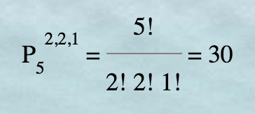
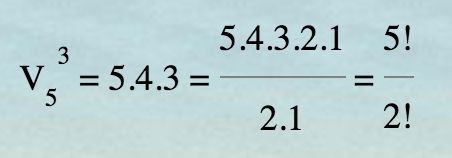
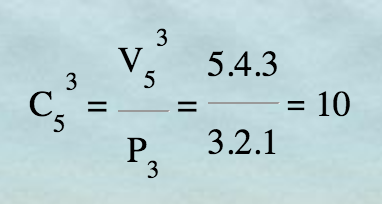
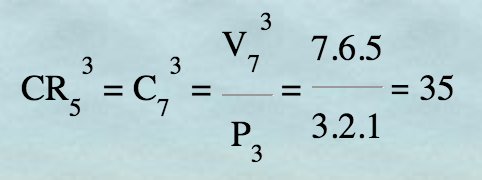
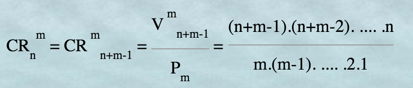

# Permutaciones

Si tengo 5 objetos `{a,b,c,d,e}`, los puedo colocar ordenadamente de muchas maneras.

Cada ordenación decimos que es una *permutación*.

### Notas

- **Selección**: Para formar una permutación se toman en cuenta todos los objetos del conjunto.
- **Orden**: Se tiene en cuenta el orden de los elementos. Si se altera el orden, entonces estamos generando una permutación nueva.
- **Repetición**: No se repiten los elementos dentro de un mismo grupo.

```
El número de permutaciones de 5 elementos se denota por P5 y equivale a:

	P5 = 5! = 5*4*3*2*1 = 120
```

# Permutaciones con repetición

Si tengo 3 objetos `{a, b, c}` , los puedo colocar ordenadamente de manera que la `'a'` aparezca 2 veces, la `'b'` otras 2 veces y la `'c'` 1 sola vez.

```
Ejemplo: bcaab
```

### Notas

- **Selección**: Para formar una permutación se toman en cuenta todos los objetos del conjunto.
- **Orden**: Se tiene en cuenta el orden de los elementos. Si se altera el orden, entonces estamos generando una permutación nueva.
- **Repetición**: Hay repetición de los elementos dentro de un mismo grupo.



# Variaciones

Si tengo 5 objetos `{a, b, c, d, e}`, puedo formar grupos ordenados de 3 de ellos de muchas maneras:
`abc, dbc, aeb, ...`.

Cada grupo ordenado decimos que es una variación de estos 5 elementos de orden 3, o también, tomados de 3 en 3.


### Notas

- **Selección**: Para formar un grupo se eligen varios elementos.
- **Orden**: Se tiene en cuenta el orden de los elementos.
- **Repetición**: No se repiten los elementos dentro de un mismo grupo.

```
El número de variaciones de 5 elementos tomados de 3 en 3  equivale a:

V = 5 * 4 * 3 = 60
```



# Variaciones con Repetición

Si tengo 5 objetos `{a, b, c, d, e}`, puedo formar grupos ordenados de 3 de ellos, pudiéndose repetir los objetos en un mismo grupo, de la manera siguiente: `ddc, eaa, bcb, aaa, ...`.

Cada grupo ordenado decimos que es una variación con repetición de estos 5 elementos de orden 3, o también, tomados de 3 en 3.

### Notas

- **Selección**: Para formar un grupo se eligen varios elementos.
- **Orden**: Se tiene en cuenta el orden de los elementos.
- **Repetición**: Si se pueden repetir los elementos dentro de un mismo grupo.

```
El número de variaciones con repetición de 5 elementos tomados de 3 en 3 se denota por VR y equivale a:

VR = 5 * 5 * 5 = 5ˆ3 = 125
```

# Combinaciones

Si tengo 5 objetos `{a, b, c, d, e}`, puedo formar grupos no ordenados (subconjuntos) seleccionando 3 de ellos de muchas maneras: `ade, ace, abc, ...`

Cada grupo decimos que es una combinación de estos 5 elementos de orden 3, o también, tomados de 3 en 3.

No se tiene en cuenta el orden: si cambiamos el orden de los elementos en un grupo, sigue siendo el mismo grupo.

### Notas

- **Selección**: Para formar un grupo se eligen varios elementos.
- **Orden**: No influye el orden de los elementos. Si se altera el orden, el grupo sigue siendo el mismo.
- **Repetición**: No se repiten los elementos dentro de un mismo grupo.

El número de combinaciones de 5 elementos tomados de 3 en 3 se denota por C53 y equivale a:




# Combinaciones con repetición

Si tengo 5 objetos {a, b, c, d, e}, puedo formar grupos tomando 3 de ellos, pudiéndose repetir los elementos en un mismo grupo, como por ejemplo: `beb, cee, dde, ...`.

Cada grupo decimos que es una combinación con repetición de estos 5 elementos de orden 3.

No se tiene en cuenta el orden: si cambiamos el orden de los elementos en un grupo, sigue siendo el mismo grupo.

### Notas

- **Selección**: Para formar un grupo se eligen varios elementos.
- **Orden**: No influye el orden de los elementos. Si se altera el orden, el grupo sigue siendo el mismo.
- **Repetición**: Sí se pueden repetir los elementos dentro de un mismo grupo.

El número de combinaciones con repetición de 5 elementos tomados de 3 en 3 se denota por CR53 y equivale a:



