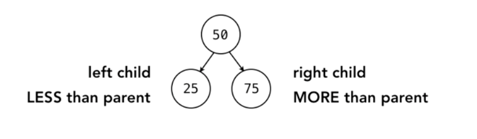
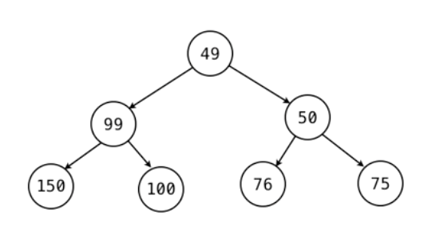

# Foundations of Programming: Data Structures

*Information taken from [Foundations of Programming: Data Structures](https://www.linkedin.com/learning/foundations-of-programming-data-structures) course.*

## Contents
* [Chapter 1. Linked Lists](#1-linked-lists)
* [Chapter 2. Stacks](#2-stacks)
* [Chapter 3. Trees](#3-queues)
* [Chapter 4. Hash Tables](#4-hash-tables)
* [Chapter 5. Set](#5-set)
* [Chapter 6. Trees](#6-trees)
* [Chapter 7. Heaps](#7-heaps)
* [Chapter 8. Graphs](#8-graphs)

##1. Linked Lists

### Arrays vs Linked Lists

**Array**

- Array support direct access (sometimes called *random access*).
- In the array, each value is next to another.
- When we insert a new item in the middle of the array, all the other items need to be shuffle around.

**Lists**

- List keeps track of sequence of elements. Each element has the pointer to the next element.
- Each element is allocated anywhere in memory.
- When we access a list, we always get the first element. We must access the elements sequentially, we can't jump to a specific element.
- Adding/removing elements is easier. We just need to adjust the pointers.

##2. Stacks
 
- It is a **LIFO (last-in / first-out)** data structure.
- **Methods:**
 	- `push`: Add an element to the end (the top of the stack).
 	- `pop`: Remove and return the element of the top of the stack.
 	- `peek`: Get the value of the element at the top of the stack.  


##3. Queues

- It is a **FIFO (first-in / first-out)** data structure.
- **Methods:**
	- `queue/put`: Add an element to the end of the queue.
	- `deque/get`: Remove and return the element from the front of the queue.

### Priority Queues
- In each element we specify a priority (an integer maybe).
- If the element that will be added to the queue has equal or lower prioriy as the last one we entered, then we don't need to make anything.
- If the new element has higher priority, it should be moved to the right position so it can be dequeued before.


### Dequeues 
- It is a double-ended Queue
- It is like having a stack and queue together.You can add/remove elements from the front or the back of the list.

##4. Hash Tables

- It is the way to build associative arrays **(dictionaries in Python)**.


### Hash Functions

- Hashing functions are typically one-way.
- Hashing should be deterministic under the same context.
- Two objects that are equal should return the same hash.

### Hashing Collision
- The same has may result from two different objects.


### How do hash tables work?

`myHT.add("AZ", "Arizona");`

1. Initially you have two elements:
	- Common array
	- Hash function
2. The key (`AZ`) is processed by the **hash function**. This function will return an integer value that will be mapped to one index of the array.
3. The value `Arizona` is saved in that index bucket that we got from the hash function.

### Managing Collisions

- **Separate chaining** is a technique where each bucket of the array contains a linked list. Once we get into the right bucket, we start looking element by element until we find what we are lokking for.

##5. Set

- It is an unordered collection of objects.
- No index, sequence, or key.
- Do not allow duplicates.
- Fast lookup.

```
Python:

>>> a = set([1,1,2,4,1,2,3,5])
>>> a
{1, 2, 3, 4, 5}
>>> a.add(6)
>>> a
{1, 2, 3, 4, 5, 6}
>>> a = frozenset([1,1,2,4,8])
>>> a
frozenset({8, 1, 2, 4})
>>> a.add(5)
Traceback (most recent call last):
  File "<stdin>", line 1, in <module>
AttributeError: 'frozenset' object has no attribute 'add'
>>>
```

### How is the fast lookup done?

- **Set implementation with Hash Table**: It passes the object trhough a hash function. The value we get from the hash function is the index where we will store that object.

##6. Trees

- It is a data structure formed by nodes connected in a hierarchiczl order.

**Terminology**

- *root node*: It is the starting node.
- *parent node*: It is any node that has pointers to other nodes (childs).
- *child node*: It is a node that comes from another node (parent).
- *sibling node*: Nodes are siblings when they come to the same parent node.
- *leaf node*: It is a node with no children.

### Binary Tree

- It is a type of tree that contains two inmmediate maximum 2 child nodes.

#### Binary Search Tree (BST)
- It is a type of structure where the right child has a higher value than the parent while the left child has a lower value than the parent.



#### Balanced Trees 
- A tree is *balanced* only if:
	1. The left and right subtrees' heights differ by at most one, **AND**
	2. The left subtree is balanced, **AND**
	3. The right subtree is balanced

	**How to calculate the height of the binary tree?**
	`height(node) = max(height(node.L), height(node.R)) + 1`
	
##### Self-Balancing algorithms
 These are bianry search tree implementations that are self-balancing:
 
 - Red-Black Trees
 - AVL Trees
 - Scapegoat Trees
 - Splay Tree

##7. Heaps

- It is used in sorting algorithms (heap sort).
- Heaps are implemented as Binary Trees.
- The tree is filled top to bottom , left to right so it is always balanced.
- Heaps are useful as priority queues.

### Rules to add a new node to the heap
- *min heap* -> Lowest value at the top of the heap.
	- **Rule**: A child must always be grater than its parent.
- *max heap* -> Highest value at the top of the heap.
	- **Rule**: A child must always be less than its parent.

- When a new value is inserted, we check with this rule if the value is correclty placed or not. if not, we start swapping with the parent recursively up to the root.



#### Array representation of the heap.

We can represent a heap using an array.

```
Heap from the image above:

heap  = [49,99,50,150,100,76,75]

left_child_index = (2*n) + 1
right_child_index = (2*n) + 2
parent_index = (child_index-1) // 2

Example: Get the childs from node with value 50

	* Node 50 has n=2
		- left  = (2*2) + 1 = 5 => heap[left]  = 76
		- right = (2*2) + 2 = 6 => heap[right] = 75
```

##8. Graphs

- It is a collection of nodes where any node can link to any other node and multiple nodes.
- **Example:** Modeling distances between cities, model a social network.

**Terminology**

- *Vertices*: Each node from the graph is a *vertice*.
- *Edges*: An *each*  is the connection between two vertices.
- *Directed graphs*: The edges may go in a single way.
- *Undirected graphs*: The edges don't have a specific direction.
- *Weight*: It is an integer value assigned to each edge. This can be used to represent distances.	