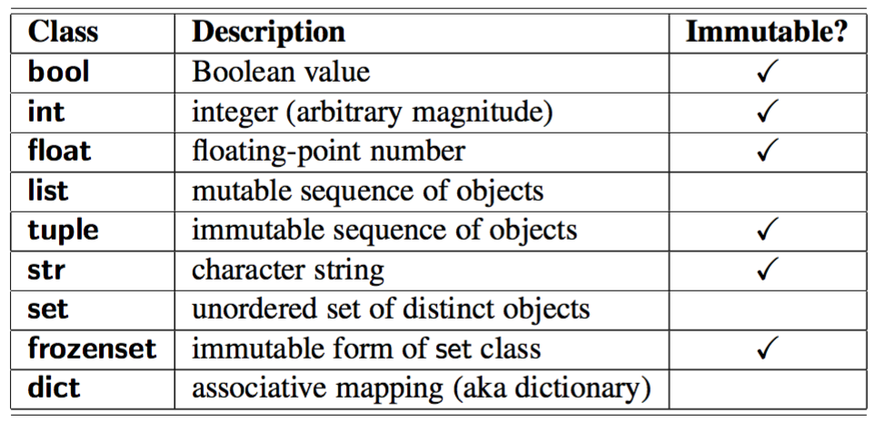

# Python Basics

## Contents
- [Python’s Built-In Classes](#pythons-built-in-classes)
- [Iterators and Generators](#iterators-and-generators)
- [Additional Python Conveniences](#additional-python-conveniences)

## Python’s Built-In Classes
A class is immutable if each object of that class has a fixed value upon instantiation that cannot subsequently be changed. For example, the float class is immutable. Once an instance has been created, its value cannot be changed 



## Iterators and Generators

- An **iterator** is an object that manages an iteration through a series of values. If variable, i, identifies an iterator object, then each call to the built-in function, next(i), produces a subsequent element from the underlying series, with - a StopIteration exception raised to indicate that there are no further elements.
An iterable is an object, `obj`, that produces an iterator via the syntax `iter(obj)`.

```
>>> mylist = [3,4,5,6]
>>> it = iter(mylist)
>>> next(it)
3
>>> next(it)
4
>>> next(it)
5
>>> next(it)
6
>>> next(it)
Traceback (most recent call last):
  File "<stdin>", line 1, in <module>
StopIteration
>>>
```

A **generator** is the way to create iterators. It is implemented with a syntax that is very similar to a function, but instead of returning values, a **yield** statement is executed to indicate each element of the series. 

As an example, consider the goal of determining all factors of a positive integer. For example, the number `100` has factors `1, 2, 4, 5, 10, 20, 25, 50, 100`. A traditional function might produce and return a list containing all factors, implemented as:

```
def factors(n):
	results = [ ]
	for k in range(1,n+1):
		if n % k == 0: 
			results.append(k)
	return results
```

In contrast, an implementation of a generator for computing those factors could be implemented as follows:

```
def factors(n):
	for k in range(1,n+1):
		if n % k == 0: 
			yield k
```

Notice use of the keyword `yield` rather than return to indicate a result. This indicates to Python that we are defining a generator, rather than a traditional function.

## Additional Python Conveniences

### Conditional Expressiones

One line expressions: `expr1 if condition else expr2`

**Example:** `param = n if n >= 0 else −n`

### Comprehension Syntax

`[ expression for value in iterable if condition ]`

Python supports similar comprehension syntaxes that respectively produce a set, generator, or dictionary. We compare those syntaxes using our example for producing the squares of numbers.

```
* list comprehension
	[ k k for k in range(1, n+1) ]
* set comprehension
	{ k k for k in range(1, n+1) }
* generator comprehension
	( k k for k in range(1, n+1) )
* dictionary comprehension
	{ k : k k for k in range(1, n+1) }
```

The **generator syntax** is particularly attractive when results do not need to be stored in memory. For example, to compute the sum of the first n squares, the generator syntax, `total = sum(k k for k in range(1, n+1))`, is preferred to the use of an explicitly instantiated list comprehension as the parameter.


##### Taken from:
- **Data Structures and Algorithms in Python**
- *Goodrich T. Michael, Tamassia Roberto & Goldwasser H. Michael*
- John Wiley & Sons,Inc (2013)
